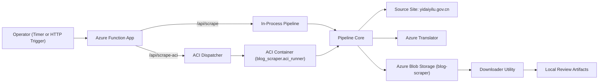
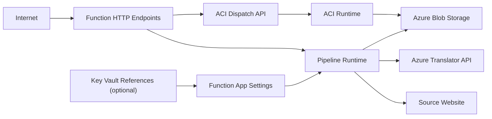
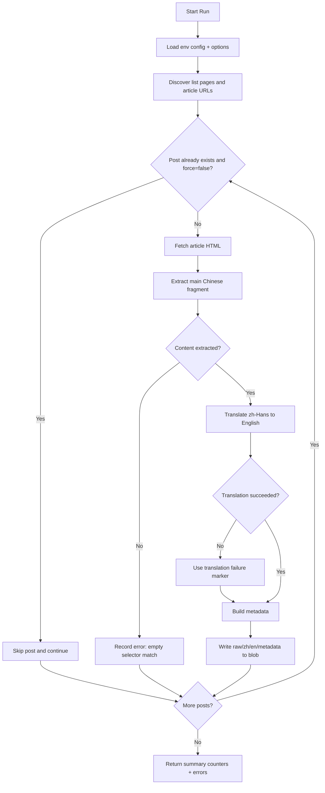
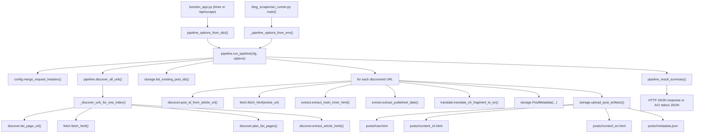
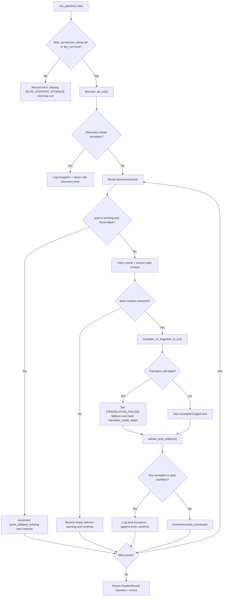

# BlogScraper Architecture and Flow

This document explains how BlogScraper works in plain English: what each service
does, how data moves through the system, and what to expect during normal and
edge-case runs.

## Architecture Diagram



## Security Trust Boundaries



Key controls:
- Input validation at HTTP and env-config boundaries.
- Least-privilege RBAC for ACI dispatch identity.
- Managed identity image pull preference for ACR.
- Controlled log-tail exposure (`include_logs=true`) with redaction.

## 1) What the system does

At a high level, BlogScraper:

1. Finds article links from one or more list pages.
2. Downloads each article page.
3. Extracts the main Chinese content section.
4. Translates that content to English.
5. Saves both languages plus metadata to Azure Blob Storage.
6. Optionally exports the latest stored posts to a local folder for review.

## 2) Main components (and why each exists)

- **Azure Function App (`westus2`)**
  - Main scheduler and API entrypoint.
  - Supports:
    - `/api/scrape` for in-process scraping inside Function runtime.
    - `/api/scrape-aci` to dispatch a one-shot ACI container run.
    - `/api/scrape-aci-status` to inspect ACI job state and logs.
  - Timer trigger runs periodic incremental scrapes.

- **Azure Container Instances (ACI, `westus2`)**
  - Runs `python -m blog_scraper.aci_runner`.
  - Used when Function outbound networking is less reliable for the target site.
  - Runs the same core pipeline logic as the Function app.

- **Azure Blob Storage (`westus2`)**
  - Canonical data store for scraped outputs in container `blog-scraper`.
  - Per-post layout:
    - `posts/<post_id>/raw.html`
    - `posts/<post_id>/content_zh.html`
    - `posts/<post_id>/content_en.html`
    - `posts/<post_id>/metadata.json`

- **Azure Translator (`westus2`)**
  - Translates `zh-Hans` source content to English.
  - If translator config is missing, code uses a stub fallback (non-production behavior).

- **Azure Container Registry (ACR, `westus2`)**
  - Stores `blog-scraper-runner` image used by ACI jobs.

## 3) Runtime entrypoints

There are three ways the pipeline is started:

1. **Scheduled (timer)**: default incremental crawl.
2. **HTTP in-process (`/api/scrape`)**: manual API-triggered run in Function host.
3. **HTTP ACI dispatch (`/api/scrape-aci`)**: manual API-triggered container run.

All three eventually call the same core pipeline in `blog_scraper/pipeline.py`.

## Pipeline Sequence Diagram



## Python Module Pipeline Diagram



## Python Error and Fallback Paths



## 4) Pipeline flow, step by step

### Step A: Build config and options

- Config is read from environment (`BlogScraperConfig.from_environ()`).
- Options determine crawl behavior:
  - `mode`: `incremental` or `historical`
  - `max_pages`: optional page cap
  - `max_posts`: optional post cap
  - `dry_run`: skip blob writes when true
  - `force`: ignore existing-post dedupe when true

### Step B: Discover article URLs

- Starts from configured list targets:
  - `BLOG_INDEX_PATH` (primary)
  - optional `BLOG_INDEX_PATHS` (CSV)
  - optional `BLOG_SCRAPER_TARGETS_JSON` (explicit target objects)
- For each target:
  - Downloads page 1.
  - Infers total page count.
  - In `incremental` mode, only page 1 is crawled.
  - In `historical` mode, crawls page range (optionally capped by `max_pages`).
- Collects unique `/p/<id>.html` links and removes excluded paths.

### Step C: Skip-or-process decision

- If a post already has `metadata.json` in blob storage and `force=false`, it is skipped.
- If `force=true`, existing posts are reprocessed and overwritten.

### Step D: Fetch, extract, and translate

For each selected post:

1. Fetch full article HTML with browser-like headers.
2. Extract main content by configured selector order.
3. Compute content SHA256 hash.
4. Best-effort extract `published_date`.
5. Translate Chinese fragment to English.
   - On translation failure, pipeline keeps going and persists a fallback marker.

### Step E: Persist artifacts

- Writes four files per post to blob storage (`raw`, `zh`, `en`, `metadata`).
- Metadata includes run id, selector used, hash, timestamps, and translation mode.

### Step F: Return summary

Pipeline returns a compact summary with:

- discovered count
- processed count
- skipped-existing count
- page-walk count
- error list (non-fatal issues are retained here)

## 5) Behavior by mode (important)

- **Incremental mode (default)**
  - Scans only first list page per target.
  - Designed for "new content since last run" operations.

- **Historical mode**
  - Scans all inferred pages (or up to `max_pages`).
  - Designed for backfill / first-time bulk ingestion.

## 6) Production vs non-production behavior

Production-like run requires:

- `dry_run=false`
- valid `BLOG_SCRAPER_STORAGE` (or `AzureWebJobsStorage`)
- valid Translator credentials (`TRANSLATOR_ENDPOINT`, `TRANSLATOR_KEY`)

Non-production/fallback behaviors:

- `dry_run=true` means no blob writes.
- Missing translator config returns stub translation text.
- Tests use fakes/mocks by design.

## 7) Failure handling strategy

- Discovery failures for one target do not necessarily crash the entire run; errors are captured.
- Per-post failures are captured and processing continues for next post.
- Translation failure does not discard scraped source content.
- ACI runner can be configured to exit non-zero on errors via env flags.

## 8) Downloader utility flow (local export)

`scripts/download_recent_posts.py` calls `blog_scraper.downloader.download_recent_posts()`:

1. List `posts/*/metadata.json` blobs.
2. Sort by blob `last_modified` descending.
3. Take top `N` (`--limit`, default 10).
4. Download:
   - metadata
   - Chinese content
   - English content
   - optional raw HTML (`--include-raw-html`)
5. Write local `index.json` summary in output folder.
6. Name each local folder/file with `<published_date>_<post_id>` when available.

## 9) Key environment variables

- Crawl targets:
  - `BLOG_SITE_BASE`
  - `BLOG_INDEX_PATH`
  - `BLOG_INDEX_PATHS`
  - `BLOG_SCRAPER_TARGETS_JSON`
- Pipeline behavior:
  - `SCRAPER_PIPELINE_MODE`
  - `SCRAPER_PIPELINE_MAX_PAGES`
  - `SCRAPER_PIPELINE_MAX_POSTS`
  - `SCRAPER_PIPELINE_DRY_RUN`
  - `SCRAPER_PIPELINE_FORCE`
- Storage:
  - `BLOG_SCRAPER_STORAGE` (preferred)
  - `AzureWebJobsStorage` (fallback)
  - `BLOB_CONTAINER_NAME`
- Translation:
  - `TRANSLATOR_ENDPOINT`
  - `TRANSLATOR_KEY`
  - `TRANSLATOR_REGION`

## 10) Manual operations examples

```bash
# Trigger ACI scrape (safe smoke example: dry run)
curl -X POST "https://<host>/api/scrape-aci?code=<function_key>" \
  -H "Content-Type: application/json" \
  -d '{"mode":"incremental","max_posts":1,"dry_run":true}'
```

```bash
# Download recent bilingual artifacts
python scripts/download_recent_posts.py \
  --limit 10 \
  --output-dir downloads/recent-posts \
  --include-raw-html
```
